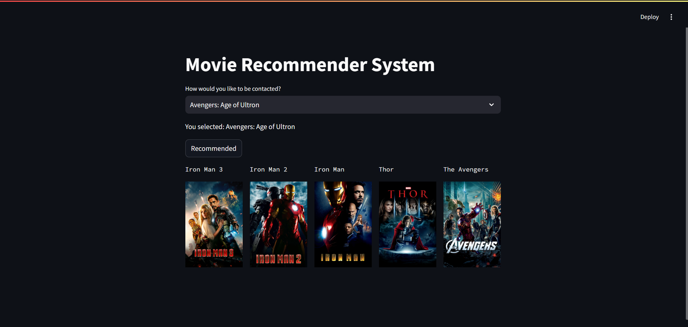
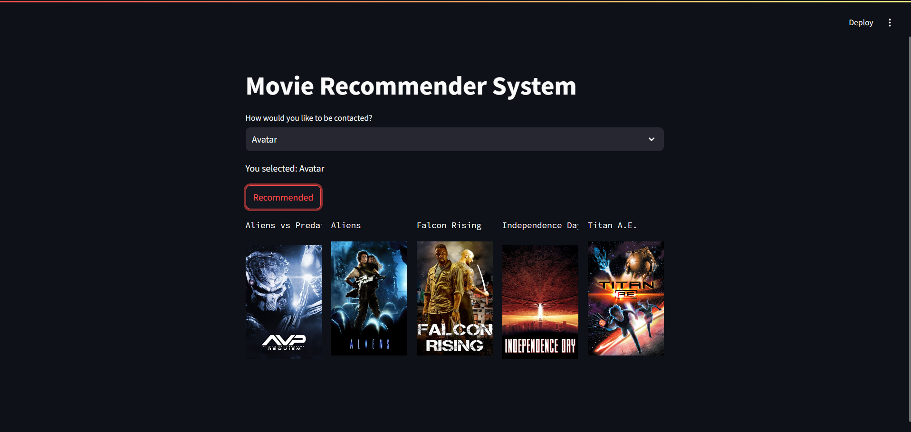

Here's a sample `README.md` for your movie recommendation project:

---

# Movie Recommendation System

This is a machine learning-based **Movie Recommendation System** built to suggest movies based on user preferences. The model analyzes patterns in the data and recommends movies using content-based filtering.

## Project Overview

- **Framework:** Streamlit is used to build the user interface.
- **Model:** A Machine Learning model built using collaborative filtering and content-based methods.
- **Data Handling:** Managed with Pandas and NumPy for efficient data manipulation.
- **File Storage:** Model data is serialized using Pickle for reusability.
- **API Requests:** Handled using the Requests library to gather data dynamically.

## Features

- **User Interaction:** Simple user interface to select or input movies.
- **Real-Time Recommendation:** Based on user-selected movies, the model generates recommendations.
- **Data Processing:** Uses Pandas and NumPy for data cleaning and manipulation.
- **Efficient Storage:** Model serialized using Pickle for quick loading.
- **Customizable:** Can be extended with additional recommendation strategies like collaborative filtering.

## Technologies Used

- **Python:** Core programming language.
- **Pandas:** For data manipulation.
- **NumPy:** For numerical computation.
- **Streamlit:** To create an interactive web interface.
- **Pickle:** For saving and loading the trained model.
- **Requests:** For handling external API requests.

## Screenshots

**1. User Input Screen**


**2. Recommended Movies Screen**


## How to Run

1. Clone the repository:
   ```bash
   git clone https://github.com/MRWICKJ/movie-recommendation.git
   ```

2. Install the dependencies:
   ```bash
   pip install -r requirements.txt
   ```

3. Run the Streamlit app:
   ```bash
   streamlit run app.py
   ```

## Contributing

Feel free to contribute by submitting pull requests or reporting issues.

